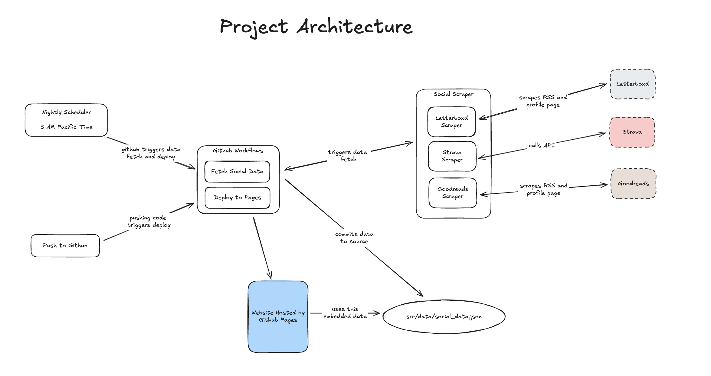

# Noah Eisen's Personal Website

A modern personal website built with Astro featuring integrated social media data from Strava, Letterboxd, and Goodreads.

## Features

- **Static Site Generation**: Built with Astro for fast, optimized performance
- **Social Media Integration**: Automatically fetches and displays data from:
  - Strava (fitness activities with interactive maps)
  - Letterboxd (movie reviews and ratings)
  - Goodreads (book reviews and reading statistics)
- **Interactive Maps**: Leaflet maps showing Strava activity routes

## Project Structure

```
├── src/
│   ├── pages/           # Astro pages
│   ├── data/            # JSON data files
│   └── games/           # Game projects
├── scripts/
│   └── social-scraper/  # Python scrapers for social media data
├── public/              # Static assets
└── dist/                # Built website
```

## Development Setup

### Prerequisites

- Node.js (for Astro)
- Python 3.x (for social media scrapers)

### Installation

1. Install Node.js dependencies:
```bash
npm install
```

2. Install Python dependencies:
```bash
pip install -r requirements.txt
```

### Environment Variables

Create a `.env` file in the `scripts/social-scraper/` directory:

```env
STRAVA_CLIENT_ID=your_strava_client_id
STRAVA_CLIENT_SECRET=your_strava_client_secret
STRAVA_REFRESH_TOKEN=your_strava_refresh_token
```

## Development

### Start Development Server
```bash
npm run dev
```

### Update Social Media Data
```bash
cd scripts/social-scraper
python fetch_social_data.py
```

### Build for Production
```bash
npm run build
```

## Social Media Scrapers

The Python scrapers automatically fetch data from:

- **Strava**: Recent runs, bike rides, hikes, and comprehensive fitness statistics
- **Letterboxd**: Recent movie reviews and user statistics
- **Goodreads**: Recent book reviews via RSS feed with caching support

Data is stored in `src/data/social_data.json` and automatically integrated into the website.

## Architecture Diagram



*High-level overview of the website architecture showing data flow from social media APIs through Python scrapers to the Astro static site.*


