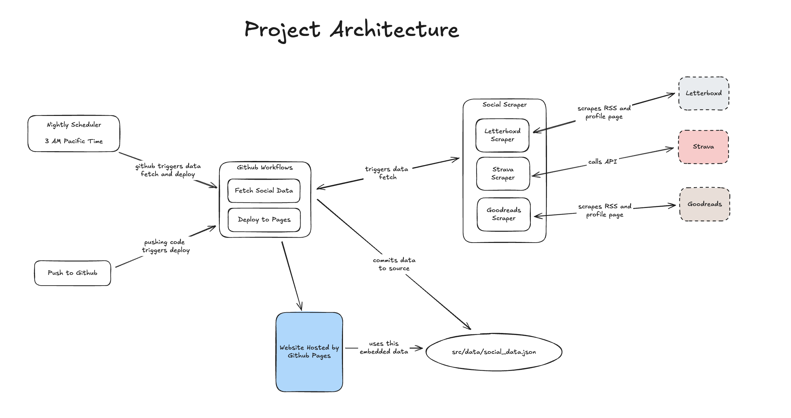

# Noah Eisen's Personal Website

A modern personal website built with Astro featuring integrated social media data from Strava, Letterboxd, and Goodreads, plus a data-driven resume pipeline.

## Features

- **Static Site Generation**: Built with Astro for fast, optimized performance
- **Social Media Integration**: Automatically fetches and displays data from:
  - Strava (fitness activities with interactive maps)
  - Letterboxd (movie reviews and ratings)
  - Goodreads (book reviews and reading statistics)
- **Interactive Maps**: Leaflet maps showing Strava activity routes
- **Data-Driven Resume**: Single source of truth JSON file generates both the website career timeline and a compiled PDF resume

## Project Structure

```
├── src/
│   ├── pages/           # Astro pages (index.astro is the entire site)
│   └── games/           # Game projects
├── scripts/
│   ├── social-scraper/          # Python scrapers for social media data
│   └── resume-generator/        # Scripts to generate resume.tex and compile PDF
├── resume/                      # Resume source of truth
│   ├── resume_data.json         # Edit this to update resume content
│   ├── resume.tex               # Auto-generated — do not edit manually
│   ├── deedy-resume.cls         # LaTeX class file
│   └── fonts/                   # Fonts required by the LaTeX template
├── public/              # Static assets (including resume.pdf)
└── dist/                # Built website (generated, not committed)
```

## Development Setup

### Prerequisites

- Node.js (for Astro)
- Python 3.x (for social media scrapers and resume generator)
- MacTeX (for compiling the resume PDF locally — download from https://www.tug.org/mactex/)

### Installation

1. Install Node.js dependencies:
```bash
npm install
```

2. Install Python dependencies:
```bash
pip install -r requirements.txt
```

### Environment Variables

Create a `.env` file in the repo root:

```env
STRAVA_CLIENT_ID=your_strava_client_id
STRAVA_CLIENT_SECRET=your_strava_client_secret
STRAVA_REFRESH_TOKEN=your_strava_refresh_token
```

## Development

### Start Development Server
```bash
npm run dev
```

### Build for Production
```bash
npm run build
```

### Update Social Media Data
```bash
python scripts/social-scraper/fetch_social_data.py

# Use cached HTML to avoid network calls (useful for dev):
python scripts/social-scraper/fetch_social_data.py --cache
```

Data is written to `src/data/social_data.json` and picked up automatically on the next build.

## Resume Pipeline

Resume content lives in a single source of truth: **`resume/resume_data.json`**.

Each work experience entry supports:
- `description` — used in the PDF; add `web_description` for a different blurb on the website
- `items` — bullet points; add `skip_pdf: true` to show a bullet on the website only
- `skip_pdf: true` at the experience level to omit the entire entry from the PDF
- `web_text` on an item to render HTML (e.g. links) on the website while keeping plain text in the PDF

After editing `resume_data.json`, run:
```bash
npm run resume
```

This will:
1. Regenerate `resume/resume.tex` from the JSON
2. Compile the PDF with `xelatex` (requires MacTeX)
3. Copy the compiled PDF to `public/resume.pdf`

### Troubleshooting PDF Compilation

If local compilation isn't working, [Overleaf](https://www.overleaf.com) is a good fallback. Upload the contents of the `resume/` directory and compile there, then download the PDF and place it at `public/resume.pdf`.

## Social Media Scrapers

The Python scrapers fetch data from:

- **Strava**: Recent runs, bike rides, hikes, and comprehensive fitness statistics via the Strava API
- **Letterboxd**: Recent movie reviews and user statistics via HTML scraping
- **Goodreads**: Recent book reviews via RSS feed

Data is stored in `src/data/social_data.json`. This file is auto-generated — do not edit it manually.

## CI/CD

GitHub Actions handles two workflows:

- **`social-data-fetch.yml`**: Runs daily at 3AM Pacific, fetches fresh social data, commits updated JSON with `[skip ci]`
- **`deploy.yml`**: Triggers on push to `master` and after the social data fetch completes; builds and deploys to GitHub Pages

## Architecture Diagram



*High-level overview of the website architecture showing data flow from social media APIs through Python scrapers to the Astro static site.*
